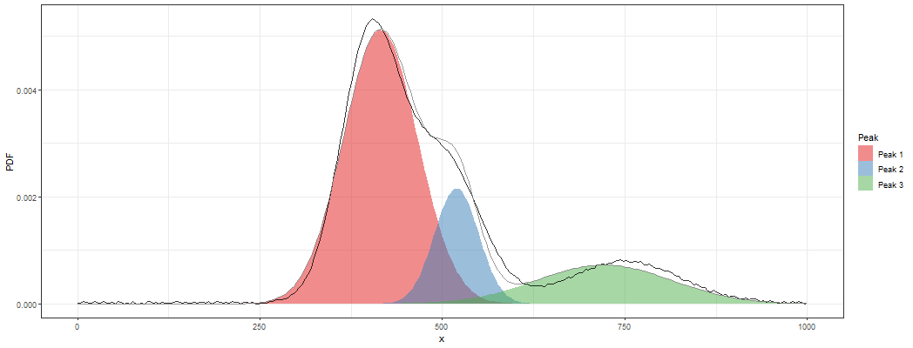
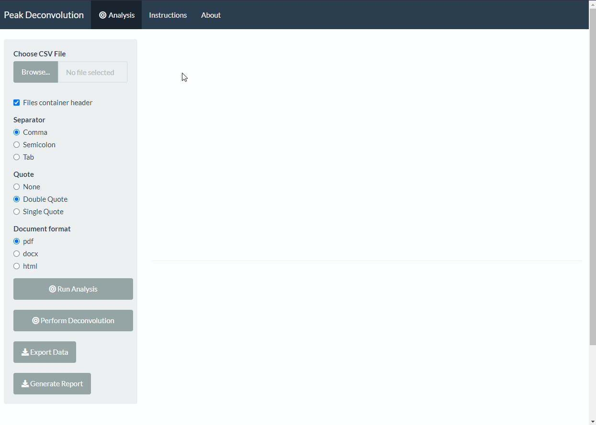

# Peak Deconvolution: A Web App for Concrete Mixture Optimization

[**Peak Deconvolution**](https://jeandsantos.shinyapps.io/peak_deconvolution/) is a Shiny app that performs the deconvolution of spectral data into its main components/peaks.

***

## How to use the app?

You can run an analysis by:  
1. Upload a CSV file with the spectral data
2. Select whether the uploaded file has header and the type of separator and quotes used
3. Click on 'Run Analysis' for a preview of the spectre
4. Click on 'Perform Deconvolution' for running the deconvolution

The analysis may take a few moments based on the length of the spectre and the potential number of components.

***
## Testing the App

If you do not have a file, you can test the app by downloading this sample [**file**](https://raw.githubusercontent.com/jeandsantos/peak_deconvolution/main/data/example_file_with_headers.csv)

***
## Reproducing the environment

You can reproduce the environment by using the [`renv`](https://rstudio.github.io/renv/) package and the `renv.lock` file available in this repo.

***

## Questions and Feedback

For questions or feedback please contact me via [LinkedIn](https://www.linkedin.com/in/jeandsantos/) or [email](mailto:jeandsantos88@gmail.com?subject=StrengthFinder%3A%20Questions%20and%20Requests).

For fixes or new feature request feel free to raise an issue.